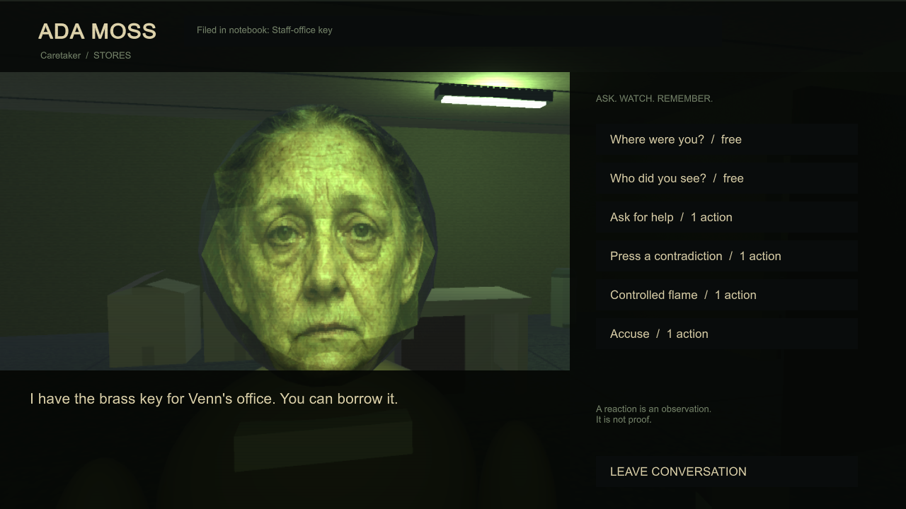

# NO CAUSE FOR ALARM

A first-person psychological horror game set during a college lockdown. Talk to twelve people, compare their accounts, ration your lighter, and decide who boards the 18:00 evacuation bus. Fire is information, not a reliable verdict.



## Play on Windows

[Download the Windows build](Distribution/NO-CAUSE-FOR-ALARM-Windows.zip), extract the entire folder, and launch **NO CAUSE FOR ALARM.exe**. The local unpacked build is `Builds/Windows/NO CAUSE FOR ALARM.exe`. Keep the executable beside its `_Data` folder, `UnityPlayer.dll`, `MonoBleedingEdge`, and the other generated runtime files. Start **Begin a new day** to play the classroom opening. **Continue case file** resumes the last saved investigation.

| Control | Action |
|---|---|
| WASD / mouse | Move / look |
| E | Talk, inspect, open or use |
| Left Shift | Sprint; uses stamina |
| Left Ctrl | Crouch |
| F | Ignite / extinguish lighter |
| R | Raise / lower lighter |
| Tab | People, evidence, chronology |
| M | Campus directory |
| Esc | Pause or close the current screen |

Four consequential actions advance each hour. Walking, reading notes, and brief questions are free. The notebook lets you wait for the next hour. At 18:00, visit the north/east end of the main corridor and interact with the transport doors to choose passengers. Wrongful detention removes useful help and changes the ending.

Settings include master, drone and SFX/voice levels, sensitivity, brightness, FOV, graphics, subtitles, analog effects and camera movement. Set the last two to zero to reduce motion and flicker. Critical clues are written in the notebook regardless of subtitle settings.

## Open or rebuild

Use Unity **6000.4.7f1** with Windows Build Support. Open this repository in Unity Hub. The project uses **URP 17.4.0**; let Package Manager finish resolving packages on first import.

Open `Assets/Scenes/EastWing.unity`, then enter Play mode. The campus is assembled by its bootstrap component. To rebuild, choose **NO CAUSE FOR ALARM → Configure and build Windows**, or run:

```powershell
powershell -ExecutionPolicy Bypass -File Tools/build.ps1
```

Do not edit runtime scripts during a build. Unity must compile the same class layouts for editor and player.

## Validation

The build runs 7,010 story assertions across 1,000 seeds before packaging. The opt-in standalone harness checks the integrated opening, helper gates, evidence, candle encounter, power repair, manifest, ending, save/load and restart. It uses a separate save file.

```powershell
powershell -ExecutionPolicy Bypass -File Tools/smoke-test.ps1
```

See [QA](Documentation/QA.md), [design and ending rules](Documentation/DESIGN.md), and [development log](DEVELOPMENT_LOG.md). Human playtesting is still needed to establish whether first-playthrough pacing meets the brief's 45–90 minute target. The implementation uses procedural character animation and written conversations, with voiced PA announcements.

## Credits

School Classrooms Asset Pack by **Styloo**, Furniture Kit by **Kenney** — both CC0. Original character mesh, environmental assembly, sound synthesis, story and code are included. Full sources and licensing details are in [ASSET_CREDITS.txt](ASSET_CREDITS.txt).

Generated `Library`, `Temp`, logs, test screenshots and unpacked builds are excluded from source control. Imported assets, their `.meta` files, package lock, project settings, build scripts and original Blender source are tracked.
